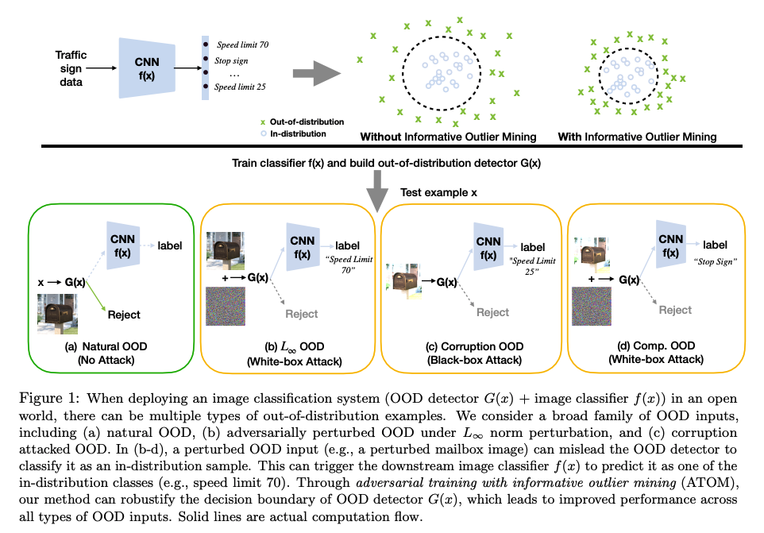
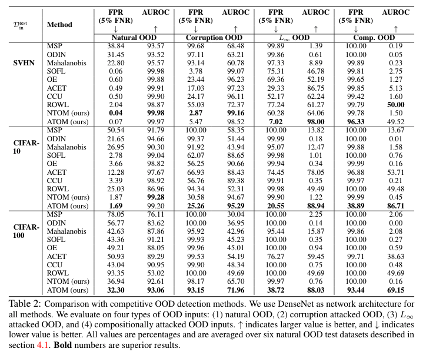

# Informative Outlier Matters: Robustifying Out-of-distribution Detection Using Outlier Mining
This project is for the paper: [Informative Outlier Matters: Robustifying Out-of-distribution Detection Using Outlier Mining](https://arxiv.org/abs/2006.15207). Some codes are from [ODIN](https://github.com/facebookresearch/odin), [Outlier Exposure](https://github.com/hendrycks/outlier-exposure), [Deep Mahalanobis Detector](https://github.com/pokaxpoka/deep_Mahalanobis_detector), [Corruption and Perturbation Robustness](https://github.com/hendrycks/robustness) and [Certified Certain Uncertainty](https://github.com/AlexMeinke/certified-certain-uncertainty).

## Illustration


## Experimental Results


## Preliminaries
It is tested under Ubuntu Linux 16.04.1 and Python 3.6 environment, and requries some packages to be installed:
* [PyTorch](https://pytorch.org/)
* [scipy](https://github.com/scipy/scipy)
* [numpy](http://www.numpy.org/)
* [sklearn](https://scikit-learn.org/stable/)

## Downloading In-distribution Dataset
* [SVHN](http://ufldl.stanford.edu/housenumbers/): need to download Format 2 data. 
* [CIFAR](https://www.cs.toronto.edu/~kriz/cifar.html): included in PyTorch.

## Downloading Auxiliary OOD Datasets

* [80 Million Tiny Images](https://groups.csail.mit.edu/vision/TinyImages/): to download **80 Million Tiny Images** dataset. In the **root** directory, run
```
cd datasets/unlabeled_datasets/80M_Tiny_Images
wget http://horatio.cs.nyu.edu/mit/tiny/data/tiny_images.bin
```
* [Downsampled ImageNet Datasets](https://patrykchrabaszcz.github.io/Imagenet32/): we use the ImageNet64x64, which could be downloaded from [ImageNet Website](http://image-net.org/download-images). After downloading it, place it in this directory: `datasets/unlabeled_datasets/ImageNet`. 

## Downloading Out-of-distribution Test Datasets

We provide links and instructions to download each dataset:

* [SVHN](http://ufldl.stanford.edu/housenumbers/test_32x32.mat): download it and place it in the folder of `datasets/ood_datasets/svhn`. Then run `python select_svhn_data.py` to generate test subset.
* [Textures](https://www.robots.ox.ac.uk/~vgg/data/dtd/download/dtd-r1.0.1.tar.gz): download it and place it in the folder of `datasets/ood_datasets/dtd`.
* [Places365](http://data.csail.mit.edu/places/places365/test_256.tar): download it and place it in the folder of `datasets/ood_datasets/places365/test_subset`. We randomly sample 10,000 images from the original test dataset. We provide the file names for the images that we sample in `datasets/ood_datasets/places365/test_subset/places365_test_list.txt`.
* [LSUN-C](https://www.dropbox.com/s/fhtsw1m3qxlwj6h/LSUN.tar.gz): download it and place it in the folder of `datasets/ood_datasets/LSUN`.
* [LSUN-R](https://www.dropbox.com/s/moqh2wh8696c3yl/LSUN_resize.tar.gz): download it and place it in the folder of `datasets/ood_datasets/LSUN_resize`.
* [iSUN](https://www.dropbox.com/s/ssz7qxfqae0cca5/iSUN.tar.gz): download it and place it in the folder of `datasets/ood_datasets/iSUN`.

For example, run the following commands in the **root** directory to download **LSUN-C**:
```
cd datasets/ood_datasets
wget https://www.dropbox.com/s/fhtsw1m3qxlwj6h/LSUN.tar.gz
tar -xvzf LSUN.tar.gz
```

## Downloading Pre-trained Models

We provide pre-trained DenseNet models for vanilla, SOFL, OE, ACET, CCU, ROWL, NTOM, and ATOM methods on SVHN, CIFAR-10, and CIFAR-100 datasets using TinyImages as auxiliary OOD dataset. They can be downloaded from [Google Drive](https://drive.google.com/drive/folders/1RdeO5zdmIZY5aExlV7q1jfzDTFgU1Xrr?usp=sharing). 

## Overview of the Code
### Running Experiments
* `select_svhn_data.py`: select SVHN test data.
* `eval_ood_detection.py`: evaluate OOD detection performance of models.
* `compute_metrics.py`: compute metrics of evaluation results.
* `gen_rowl_train_data.py`: generate ROWL training data.
* `gen_validation_data.py`: generate validation data used to select the best q.
* `train_acet.py`: train ACET model.
* `train_atom.py`: train ATOM model.
* `train_ccu.py`: train CCU model.
* `train_oe.py`: train OE model.
* `train_rowl.py`: train ROWL model.
* `train_sofl.py`: train SOFL model.
* `train.py`: train vanilla model.
* `tune_mahalanobis_hyperparams.py`: tune hyperparameters of Mahalanobis detector.
* `tune_odin_hyperparams.py`: tune hyperparameters of ODIN detector.

### Example
For CIFAR-10 experiments, you can run the following script to get the results: 

`./run_all_cifar10_exps.sh`

To evaluate an OOD detection method, you can use the following command: 

`python eval_ood_detection.py --in-dataset {in-distribution dataset} --name {model name} --method {scoring function} [--adv or --corrupt or --adv-corrupt]`

The argument `--adv` is to evaluate L_inf OOD, `--corrupt` is to evaluate Corrupted OOD, `--adv-corrupt` is to evaluate Comp. OOD. You can only specify one of them. Without them, it will evaluate natural OOD. 

`{in-distribution dataset}` can be `SVHN`, `CIFAR-10` or `CIFAR-100`. 

`{scoring function}` can be `msp`, `odin`, `mahalanobis`, `sofl`, `rowl`, `ntom` or `atom`. 

`{model name}` is the name of the model that you have trained. The model type should match the corresponding scoring function. See the following table for the matchings: 

| Model Type  | Scoring Function |
| ------------- | ------------- |
| vanilla  |  msp |
| vanilla  | odin  |
| vanilla  | mahalanobis  |
| SOFL     |  sofl |
| OE       |  msp  |
| ACET     |  msp |
| CCU      |  msp |
| ROWL     |  rowl |
| NTOM     | ntom |
| ATOM     | atom | 

### Citation 
Please cite our work if you use the codebase: 
```
@article{chen2020informative-outlier-matters,
title={Informative Outlier Matters: Robustifying Out-of-distribution Detection Using Outlier Mining},
author={Chen, Jiefeng and Li, Yixuan and Wu, Xi and Liang, Yingyu and Jha, Somesh},
journal={arXiv preprint arXiv:2006.15207},
year={2020}
}
```

### License
Please refer to the [LICENSE](LICENSE).